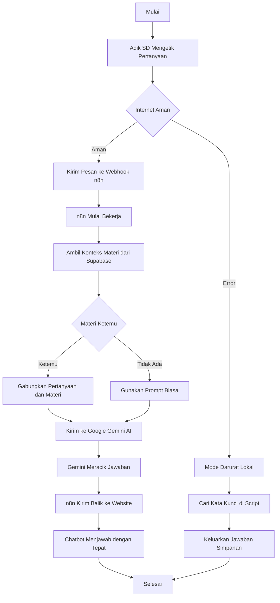
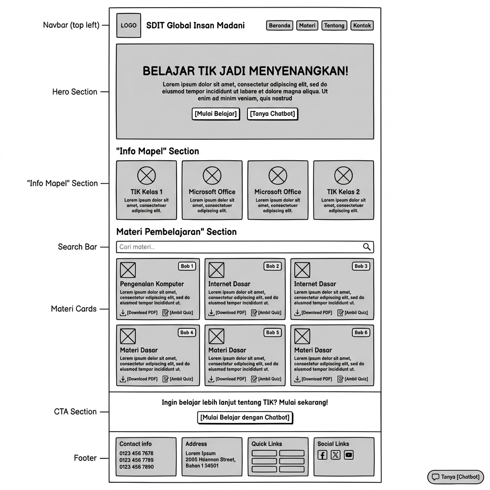
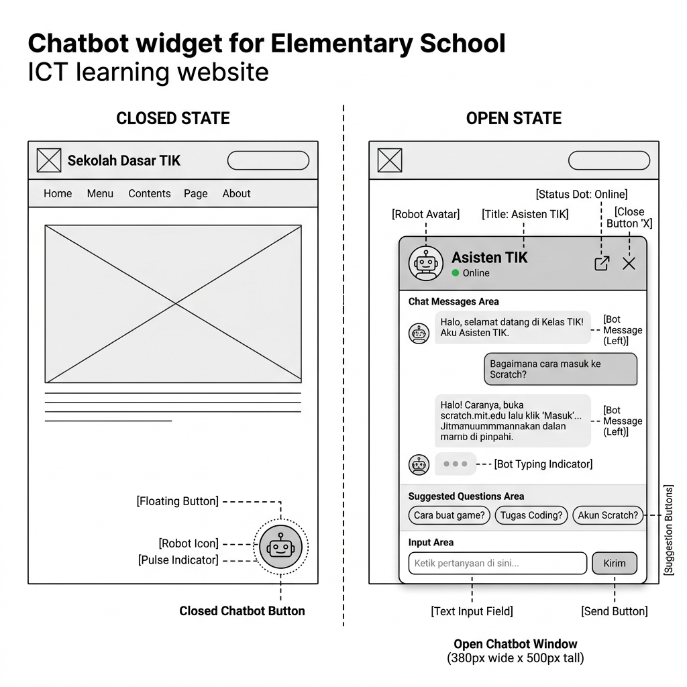
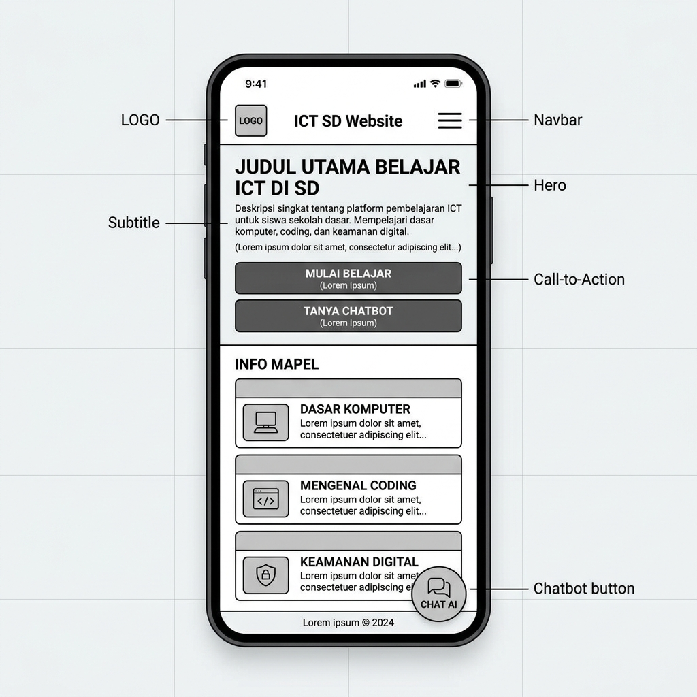
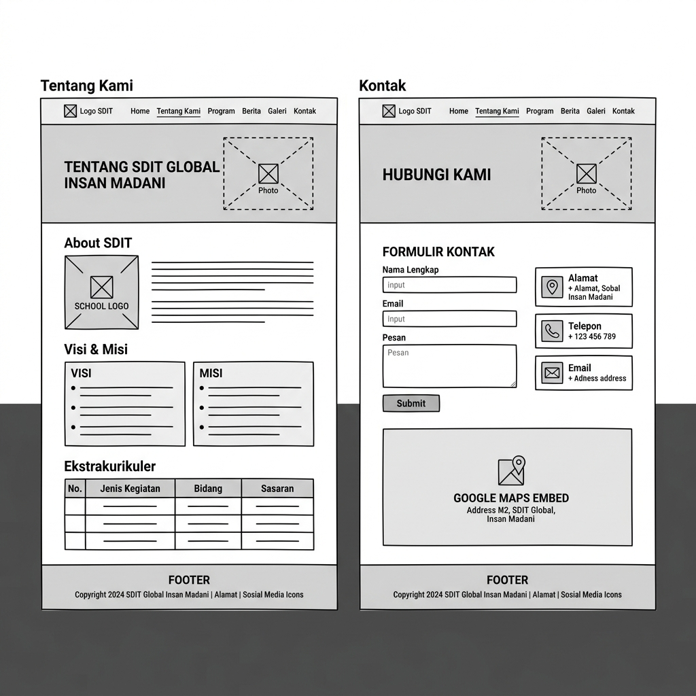
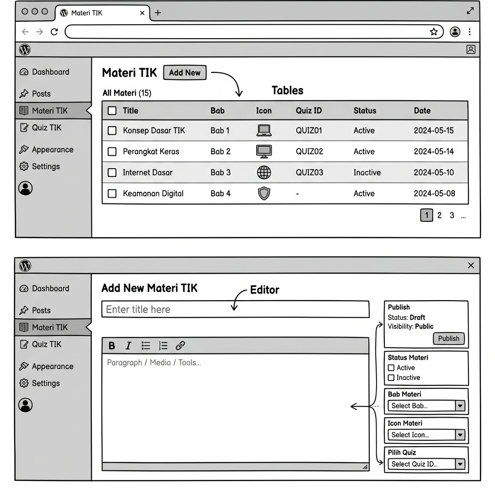

# 🎀 SDIT Global Insan Madani - TIK Learning Platform 🎀

**Pengembangan Chatbot AI Pembelajaran Mata Pelajaran TIK Berbasis Framework RAG**

*Tugas Akhir Skripsi 🎓 Meli Putri Yani*


  
*Belajar TIK jadi lebih seru dan pintar bareng AI!* 🧸✨

---

## 🌟 Tentang Project
Halo! Selamat datang di repositori skripsiku! 👋💖

Website ini adalah *Learning Management System* (LMS) sederhana yang dirancang khusus untuk adik-adik Sekolah Dasar kelas TIK (Teknologi Informasi & Komunikasi). 

Keajaiban utama dari project ini adalah **Chatbot AI Pintar** yang ditenagai oleh Google Gemini dengan arsitektur **Retrieval-Augmented Generation (RAG)**! 🧠✨ 
Dengan teknologi ini, AI hanya akan menjawab pertanyaan berdasarkan materi pelajaran sekolah yang dimasukkan oleh guru. Jadi, super aman dari jawaban yang aneh-aneh (anti-halusinasi)! 🛡️

## 🎬 Demo Aplikasi
*(Halo Meli! Nanti kalau webnya sudah online, rekam layar saat kamu ngobrol sama chatbot pakai aplikasi pembuat GIF, lalu ganti tulisan di bawah ini dengan gambar/video kamu ya!)*

> 📌 **[ TEMPAT UNTUK VIDEO ATAU GIF DEMO CHATBOT NANTI ]**

## ✨ Fitur Spesial
- **🎓 Kelas Materi TIK** - Guru bisa dengan mudah menambah atau mengedit pelajaran.
- **📝 Kuis Seru** - Tes pemahaman adik-adik dengan kuis interaktif yang *fun*.
- **🤖 Teman Belajar 24/7 (Chatbot)** - Malu bertanya di kelas? Tanya aja ke AI kapan pun!
- **🛡️ Sistem RAG (Aman & Akurat)** - Konteks jawaban dibatasi hanya pada kurikulum sekolah.
- **🚨 Fallback Darurat** - Kalau server internet lagi ngambek, chatbot punya jawaban cadangan *offline* biar website nggak *error*.
- **📱 Responsif** - Tetap cantik dan rapi saat dibuka lewat *smartphone*! 🌷

---

## 🏗️ Arsitektur Sistem 
Project ini adalah hasil kolaborasi beberapa teknologi modern yang diracik menjadi satu kesatuan yang manis: 🍰

| Komponen | Teknologi | Tugasnya Ngapain Aja |
| :--- | :--- | :--- |
| **Baju & Tulang (Front/Back)** | WordPress | Menampilkan antarmuka web, materi, dan wajah si chatbot. |
| **Ingatan Biasa (DB)** | MySQL | Mengingat siapa saja muridnya dan soal-soal kuis. |
| **Ingatan Spesial RAG (Vector)** | Supabase | Menyimpan memori materi pelajaran dalam bentuk angka (vektor) supaya AI gampang mencarinya. |
| **Pengatur Lalu Lintas** | n8n | Jembatan pengantar pesan dari *website* ke database lalu ke AI. |
| **Otak Utama (LLM)** | Google Gemini | Membaca materi dan merangkai jawaban dengan bahasa yang ramah anak SD. |

### 🔄 Bagaimana AI Berpikir? (RAG Flowchart)
Intip logika berpikir chatbot saat ada murid yang bertanya:



---

## 📊 Hasil Pengujian Sistem
*Project* ini bukan cuma sekadar kode, tapi sudah diuji langsung lho! 🚀

- **Black Box Testing:** Semua fungsi dari *login*, tambah materi, kuis, sampai pemanggilan API berjalan **100% Sesuai Harapan**.
- **User Acceptance Test (UAT):** Sistem ini mampu menyaring pertanyaan di luar konteks sekolah dengan akurat, membuktikan bahwa arsitektur RAG berhasil mencegah halusinasi AI pada anak-anak. 🎉

*(Catatan buat Meli: Boleh ditambah angka persentase kelulusan UAT atau nilai kuisioner di sini nanti ya!)*

---

## 🎨 UI/UX Wireframes
Berikut adalah sketsa rancangan wajah *website* ini sebelum di- *coding*:

### 1. Halaman Beranda
Menampilkan *Hero section*, informasi mata pelajaran, dan daftar materi TIK.



### 2. Chatbot Widget (Web & Mobile)
Antarmuka *chatbot* saat tertutup (*floating button*) dan saat terbuka.



### 3. Tampilan Mobile (Responsif)
Desain yang disesuaikan untuk layar *smartphone*.



### 4. Halaman Tentang & Kontak



### 5. Panel Admin (WordPress Backend)
Antarmuka pengelolaan *Custom Post Type* Materi TIK.



---

## 🚀 Cara Menjalankan Project Secara Lokal
Buat kamu yang ingin menjalankan *project* ini di laptopmu (khususnya untuk dosen penguji ✌️):

1. **Siapkan Tools:** Pastikan aplikasi Laragon sudah ter- *install*.
2. **Kloning Repo:**
   ```bash
   git clone https://github.com/username/website-tik-sdit.git websiteku
   ```
   *Pindahkan folder `websiteku` ke dalam `C:\laragon\www\`.*
3. **Mulai Mesin:** Buka Laragon dan klik **Start All**.
4. **Siapkan Ingatan:** 
   - Buka Database Manager (seperti HeidiSQL/phpMyAdmin).
   - Buat database dengan nama `websiteku`.
   - Lakukan *Import* file `database_websiteku.sql`.
5. **Akses Website:** Buka browser dan pergi ke URL `http://websiteku.test`
6. **Ruang Guru (Admin):** Login lewat `http://websiteku.test/wp-admin` 

---

## 💌 Tentang Penulis & Lisensi

**Meli Putri Yani** 🌷  
*Mahasiswa Program Studi Sistem Informasi*  
Sekolah Tinggi Teknologi Terpadu Nurul Fikri (2026)

Project ini dikembangkan sepenuhnya untuk **Kebutuhan Akademis (Tugas Akhir Skripsi)**. Silakan jadikan referensi untuk riset yang lebih luas mengenai penerapan *Generative AI* di ranah pendidikan anak!

📫 **Mari Berteman!**  
Punya pertanyaan seputar project ini atau mau *connect*? Jangan ragu untuk hubungi aku di:  

[](https://linkedin.com/in/meli-putri-yani)  

*Skripsi Berdampak: Memajukan Pendidikan TIK Anak Bangsa dengan Kecerdasan Buatan* 💫
