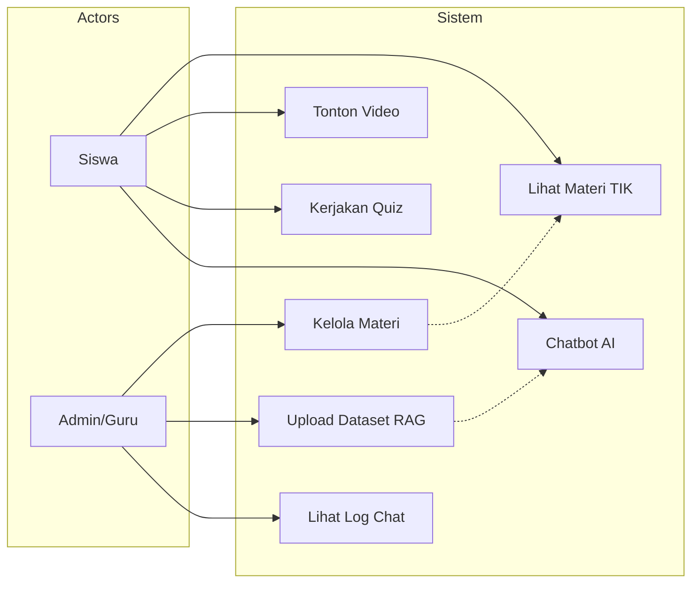
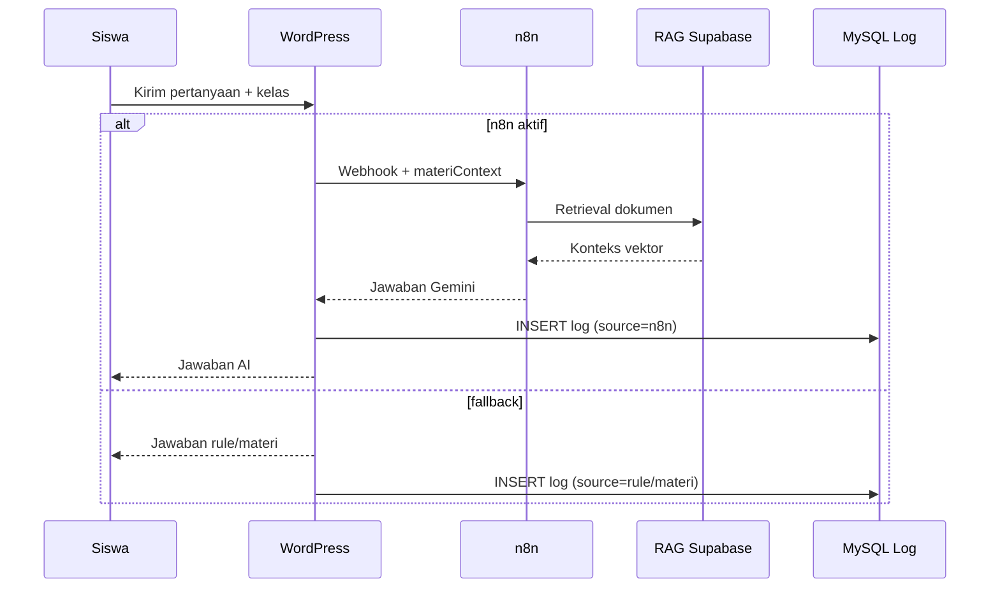
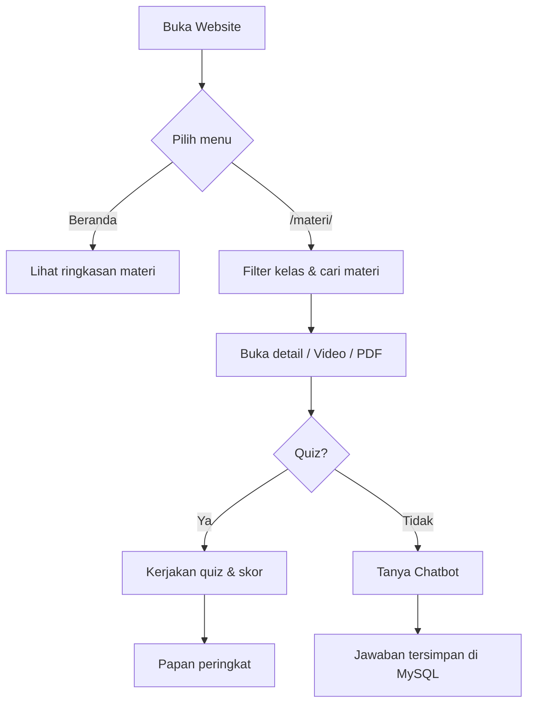
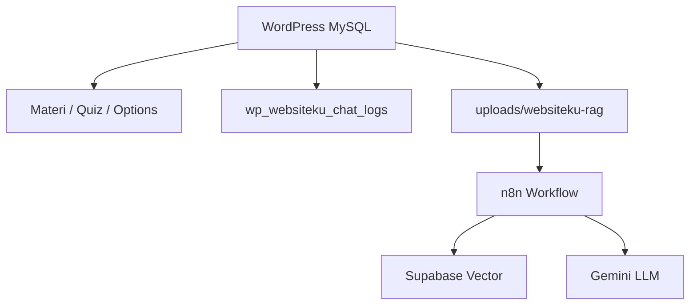

# Lampiran Diagram untuk Skripsi (BAB III & IV)

Salin blok **Mermaid** di bawah ini ke [Mermaid Live Editor](https://mermaid.live) lalu export PNG/SVG untuk Word/PDF.

Diagram lengkap juga ada di:
- `docs/diagram_skripsi_bab3_4.md`
- `docs/diagram_tambahan_skripsi.md`

---

## 1. Use Case Diagram (ringkas)

---

## 2. Sequence Diagram — Chatbot + RAG + Log MySQL

---

## 3. Flowchart — Alur Siswa Belajar

---

## 4. Arsitektur Data (Proposal BAB IV)

---

*Setelah export gambar, sisipkan ke naskah dengan caption: Gambar X.X Use Case Diagram, dll.*
