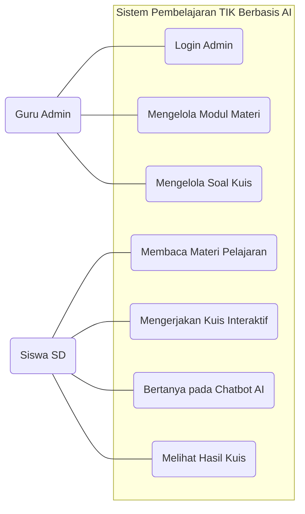
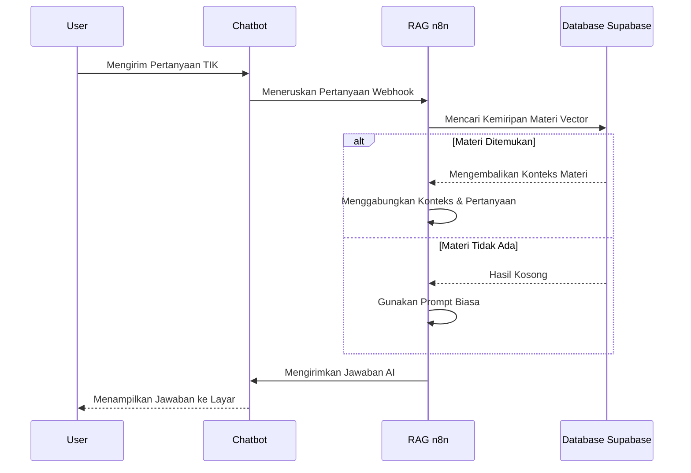
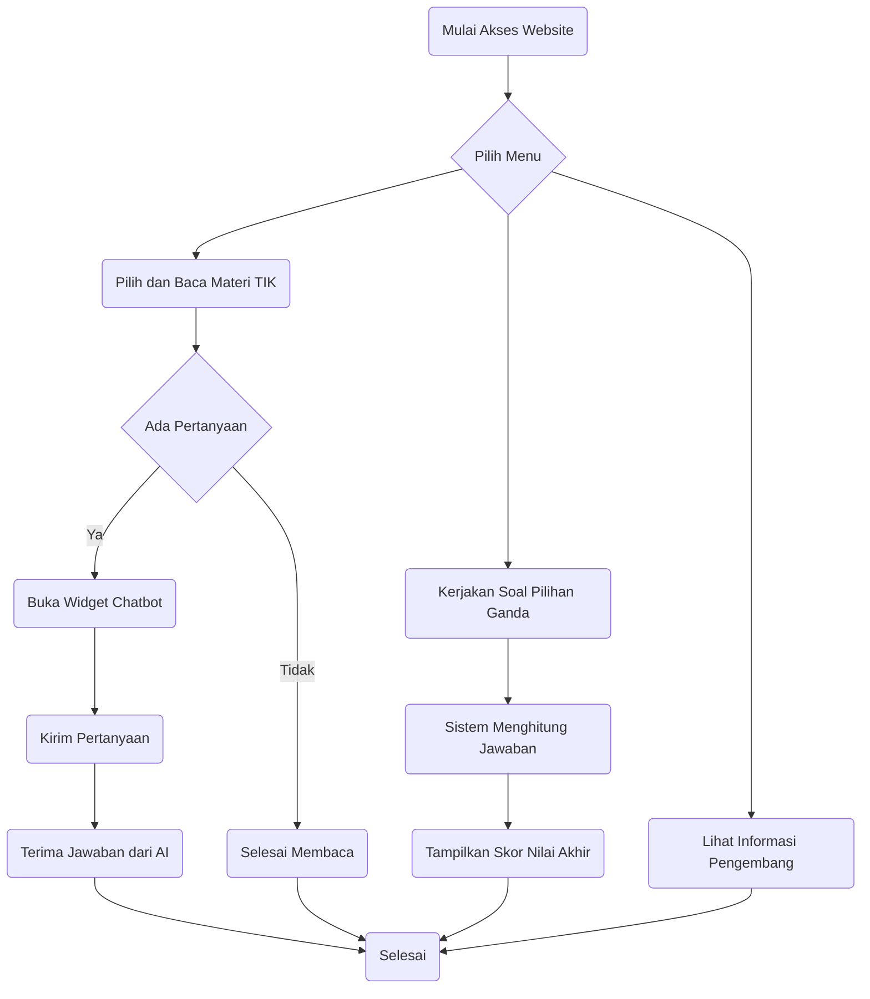

# 📊 Diagram Tambahan untuk Skripsi (Bab III / Bab IV)

File ini berisi **Use Case Diagram** dan **Flowchart Sistem Umum** yang sangat dibutuhkan untuk laporan skripsi (Biasanya ditaruh di Bab III Perancangan Sistem atau Bab IV Implementasi).

Kamu bisa *copy-paste* kode di bawah ini ke editor Mermaid online (seperti [Mermaid Live Editor](https://mermaid.live/)) untuk men-download gambarnya, atau biarkan di sini karena GitHub bisa langsung menampilkannya menjadi gambar.

---

## 1. Use Case Diagram
Diagram ini menjelaskan interaksi antara pengguna (Guru/Admin dan Siswa) dengan fitur-fitur di dalam website.

*Penjelasan Use Case untuk narasi Bab IV:*
- **Guru/Admin:** Memiliki hak akses penuh untuk masuk ke Dashboard WordPress (Login), menambahkan/mengubah materi pelajaran TIK, dan mengatur pertanyaan kuis.
- **Siswa:** Berperan sebagai pengguna akhir yang dapat membaca materi, mengerjakan kuis untuk menguji pemahaman, melihat nilai secara langsung, dan bertanya pada Chatbot AI jika ada materi yang kurang dipahami.

---

## 2. Diagram Alur Chatbot Lintas Fungsi (Swimlane / Sequence)
Untuk menggambarkan alur seperti pada gambar keduamu (yang dibagi menjadi kolom User, Chatbot, RAG, dan Database), dalam dunia *UML* biasanya digunakan **Sequence Diagram** atau **Activity Diagram dengan Swimlane**.

Berikut adalah representasinya dalam bentuk **Sequence Diagram** (Sangat disarankan untuk skripsi karena lebih profesional):

*(Catatan: Jika kamu **wajib** menggunakan diagram kotak-kotak bertabel / Swimlane Activity persis seperti gambarmu, kamu harus menggambarnya secara manual menggunakan aplikasi seperti **Microsoft Visio** atau situs web gratis **[Draw.io](https://app.diagrams.net/)** karena Mermaid tidak memiliki format tabel untuk Flowchart).*

---

## 3. Flowchart Sistem Umum (User Flow)
Berbeda dengan *Flowchart* RAG (yang khusus membahas cara kerja AI), *Flowchart* ini menggambarkan alur perjalanan siswa saat menggunakan website dari awal sampai akhir.

*Penjelasan Flowchart untuk narasi Bab IV:*
1. Siswa memulai dengan membuka halaman utama website.
2. Siswa dihadapkan pada pilihan menu: Materi, Kuis, atau Kontak.
3. Jika memilih **Materi**, siswa membaca modul. Apabila ada kebingungan, siswa dapat membuka *widget* Chatbot untuk berinteraksi dengan AI.
4. Jika memilih **Kuis**, siswa menjawab serangkaian soal dan sistem akan otomatis memberikan skor akhir.
5. Selesai.
