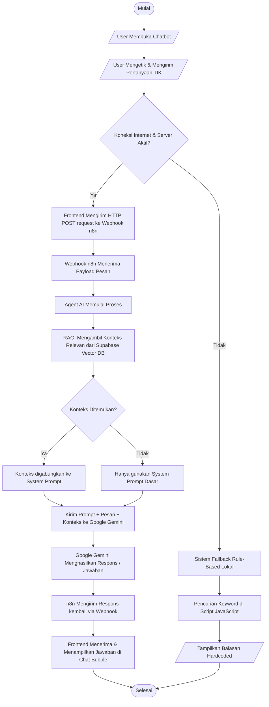

# Wireframe & Flowchart Tambahan
## BAB IV: Hasil dan Pembahasan

---

## 1. Wireframe Antarmuka Mobile (Smartphone)
Karena website bersifat responsif, berikut adalah rancangan antarmuka saat diakses melalui perangkat *smartphone*.

**Keterangan:**
- Navbar berubah menjadi Hamburger Menu (tombol garis tiga).
- Elemen konten yang sebelumnya menyamping (kolom) berubah menjadi bersusun ke bawah (vertikal) agar mudah di-*scroll*.
- Tombol Chatbot tetap *floating* di pojok kanan bawah agar mudah dijangkau ibu jari.

---

## 2. Wireframe Halaman Admin (WordPress)
Berikut adalah rancangan antarmuka *backend* bagi guru/admin untuk mengelola materi dan quiz.

**Keterangan:**
- **Panel Kiri (Tabel Data):** Menampilkan daftar materi TIK yang sudah dibuat beserta kolom Bab, Ikon, Status Aktif, dan Relasi Quiz.
- **Panel Kanan (Form Input):** Form *Custom Post Type* yang dilengkapi *Meta Box* di sebelah kanan untuk memilih Bab, mengganti ikon, mengatur status materi, dan menautkan kuis terkait.

---

## 3. Flowchart Alur Sistem Chatbot AI (n8n + RAG)
Berikut adalah *Flowchart* yang menggambarkan alur kerja sistem dari saat pengguna mengetik pesan hingga AI membalas. (Diagram ini sangat cocok untuk BAB IV bagian Arsitektur/Flow System).

### Penjelasan Flowchart:
1. **User Input:** Siswa membuka chatbot dan mengirimkan pertanyaan.
2. **Pengecekan Fallback:** Jika server n8n mati, sistem menggunakan fallback script lokal yang berbasis deteksi *keyword*.
3. **Webhook n8n:** Jika server aktif, pesan dikirim ke `Webhook URL` n8n.
4. **Proses RAG:** Sistem mengambil data yang relevan dari Vector Database (Supabase) berdasarkan pertanyaan siswa.
5. **Proses AI:** Data konteks dan pertanyaan diberikan kepada Google Gemini.
6. **Respons:** AI memproses jawaban dan mengembalikannya ke layar *chat* siswa.
